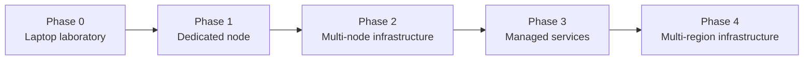

<div align="center">

# ☁️ Cloud Infrastructure Platform

### Building a small cloud from first principles, one reliable layer at a time.

<p>


</p>

**A working infrastructure laboratory for learning, proving, and eventually operating cloud services.**

</div>

---

## 🧭 Why this exists

This repository is the technical and product ground for building an independent cloud infrastructure platform. It deliberately starts small: a laptop is the first infrastructure host, not the final data centre.

> The first proof is simple: create or register a real virtual machine, read its state, start/stop/restart it, persist its resource record, and delete it.

## 🗺️ Growth path



<table>
<tr><td width="50%">

### 🧠 Control plane
Provisioning, resource state, lifecycle operations, and orchestration.

### 🖥️ Compute
Virtual machines today, scalable compute tomorrow.

</td><td width="50%">

### 💾 Storage
Persistent data and storage services as the platform matures.

### 🌐 Networking
Reliable networking, isolation, and service connectivity.

</td></tr>
</table>

## 🧪 Phase 0 lab

The first runnable implementation lives under `lab/`:

```text
lab/
├── host-check.sh
├── control-plane.py
└── README.md
```

It uses real **libvirt**, `virsh`, `virt-install`, `qemu-img`, and SQLite rather than a mock provisioning layer.

<details open>
<summary><strong>🔍 Current scope</strong></summary>

- Host capability inspection
- Local control-plane HTTP interface
- Real virtual-machine lifecycle operations
- Resource persistence
- Initial safety rules and acceptance criteria

</details>

## 📚 Documentation map

```text
docs/
├── 00-project-charter.md
├── 01-product-vision.md
├── 02-architecture.md
├── 03-laptop-cloud-lab.md
├── 04-mvp-specification.md
├── 05-infrastructure-requirements.md
├── 06-security-and-operations.md
├── 07-roadmap.md
├── 08-economics.md
├── 09-open-decisions.md
└── 10-build-log.md
```

## ⚠️ Engineering rule

A user interface is not proof of an infrastructure capability. Every important feature must eventually connect to real resources, real state, and real measurements.

## 📌 Status

**Phase 0 implementation started.** No production cloud infrastructure is implied by the existence of this repository.

## 🔐 Ownership

This repository contains proprietary infrastructure software and documentation. See [`LICENSE`](./LICENSE) for usage terms.
